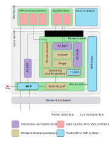

# Carnx

XDP-based network statistics digger.

## What is XDP ?

**XDP** (for eXpress Data Path) is a Linux Kernel feature (`>=4.8`) providing an early hook in the incoming packets queue (RX).

The hook is placed in the network interface controller (NIC) driver just after the interrupt processing, and before any memory allocation needed by the network stack itself ([Wikipedia][1]). The following diagram details the position of XDP within the Linux kernel.



The main assets of XDP are the following:
- XDP does not require memory allocation
- XDP hook code is run in the kernel cutting down its CPU usage

Due to this design, XDP is then rather competitive with kernel-bypass methods (like [DPDK][6] or [PF_RING][7]) but easier to integrate. In comparison with userspace methods, it can process roughly 5x more packets than classical tools (like `iptables`). 
You can have a look to the benchmarks in this [repository][5]. See the [original paper][2] and the corresponding [presentation][8] for a deeper description of XDP.


## Architecture of carnx

The design of XDP constraints its use. In particular carnx is divided into several components to manage both the kernel hook and the incoming requests of the server.


### Kernel hook

The program processing the incoming packets is `carnx.bpf`. Its sources are written in `C` and are then compiled to `eBPF` with `clang` (XDP hooks are run by the eBPF virtual machine).
This code is very critical as it runs in kernel mode, therefore it is verified by the kernel when we want to load it. There are many constraints to pass the *verifier*: limited program size, no loop, buffer bounds must be checked before accesses... 
This program is implemented so as to update some counters from incoming packets.
Once you have [built the program](#build), you can fetch the list of the counters through:

```console
# grpcurl -plaintext -emit-defaults -unix /run/carnx.sock api.Carnx/GetCounterNames
{
  "counters": [
    "PKT",
    "IP",
    "IP6",
    "TCP",
    "UDP",
    "ICMP",
    "ICMP6",
    "ARP",
    "ACK",
    "SYN"
  ]
}
```

### BPF Map

The kernel hook increments some counters but naturally we want to fetch these values to a user-space application (our server). For this purpose XDP can use all the BPF ecosystem (recall that XDP is merely a BPF program) which notably provides *Maps* to share memory between the kernel side and the user side.

Several map types exist. Carnx use currently a single map (`XDP_CARNX_MAP`) storing counter values: counters are referenced by an index `i` and their value is merely `XDP_CARNX_MAP[i]`. So, our map behaves like an array. 

Actually, there is not a single map but one for each CPU core. Why? In a Linux system, you have not a single RX queue but one for every core. Packets are well dispatched to the cores and are then processed in parallel (see [this post][10] for a more detailed view of the linux networking stack receiving data).


## Build

Currently you can only get carnx from sources. First you have to compile `libbpf.so` and then you can build both `libcarnx.so` and `carnxd`.

```console
$ make libbpf
$ make
```

Then you can test carnx (as root) through

```console
# tests/unix-test.sh 
```

In particular it check the API. If there is a problem, you will see it :)


## Install 

After the build, you can install everything with
```console
# make install
```

In details it does the following:
- The BPF library files (`libbpf.so` and `libbpf.so.0`) are installed to `/usr/lib`
- The carnx library (`libcarnx.so`) too
- The carnx binary (`carnxd`) is installed to `/usr/bin`
- The `systemd` files (`carnx.socket` and `carnx.service`) are installed to `/lib/systemd/system/` 

You can test carnx in two ways:

You can remove the installed files by calling
```console
# make uninstall
```

## Get started

Basically you can start the server by defining the path to the BPF program and the network interface to monitor:
```console
# carnxd --interface lo --load /var/lib/carnx/carnx.bpf
```

The program cannot be put into background (daemonize). For this purpose, you should use the `systemd` service. By default it will listen to the localhost interface `lo`. Currently you must modify it by editing `/lib/systemd/system/carnx.service`.

To test the server, you can install [grpcurl][9] and request a snapshot from the server (the current values of the counters).
```console
# grpcurl -plaintext -emit-defaults -unix /run/carnx.sock api.Carnx/Snapshot
```

## API

The gRPC API is detailed in the [api](api/) sub-directory.

[1]: https://en.wikipedia.org/wiki/Express_Data_Path
[2]: https://github.com/xdp-project/xdp-paper/blob/master/xdp-the-express-data-path.pdf
[3]: http://vger.kernel.org/lpc_net2018_talks/lpc18_paper_af_xdp_perf-v2.pdf
[4]: https://www.linuxplumbersconf.org/event/2/contributions/71/attachments/17/9/presentation-lpc2018-xdp-tutorial.pdf
[5]: https://github.com/xdp-project/xdp-paper/tree/master/benchmarks
[6]: https://www.dpdk.org/
[7]: https://www.ntop.org/products/packet-capture/pf_ring/
[8]: https://github.com/xdp-project/xdp-paper/blob/master/xdp-presentation.pdf
[9]: https://github.com/fullstorydev/grpcurl
[10]: https://blog.packagecloud.io/eng/2016/06/22/monitoring-tuning-linux-networking-stack-receiving-data/