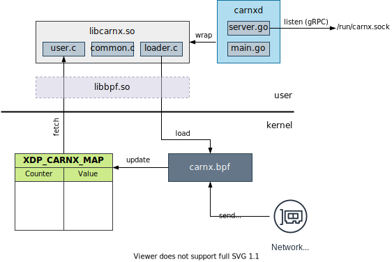

# Carnx

XDP-based network statistics digger.

## What is XDP ?

**XDP** (for eXpress Data Path) is a Linux Kernel feature (`>=4.8`) providing an early hook in the incoming packets queue (RX).

The hook is placed in the network interface controller (NIC) driver just after the interrupt processing, and before any memory allocation needed by the network stack itself ([Wikipedia][1]). The following diagram details the position of XDP within the Linux kernel.


The main assets of XDP are the following:
- XDP does not require memory allocation
- XDP hook code is run in the kernel cutting down its CPU usage

Due to this design, XDP is then rather competitive with kernel-bypass methods (like [DPDK][6] or [PF_RING][7]) but easier to integrate. In comparison with userspace methods, it can process roughly 5x more packets than classical tools (like `iptables`). 
You can have a look to the benchmarks in this [repository][5]. See the [original paper][2] and the corresponding [presentation][8] for a deeper description.

## Architecture



## Build

Currently you can only get carnx from sources.

```console
$ make libbpf
$ make
```

Then you can test carnx (as root) through

```console
# tests/unix-test.sh 
```

In particular it check the API. If there is a problem, you will see it :)


## Install 

After the build, you can install everything with
```console
# make install
```

In details it does the following:
- The BPF library files (`libbpf.so` and `libbpf.so.0`) are installed to `/usr/lib`
- The carnx library (`libcarnx.so`) too
- The carnx binary (`carnxd`) is installed to `/usr/bin`
- The `systemd` files (`carnx.socket` and `carnx.service`) are installed to `/lib/systemd/system/` 

You can test carnx in two ways:

You can remove the installed files by calling
```console
# make uninstall
```

## Get started


## API

The gRPC API is detailed in the [api](api/) sub-directory.

[1]: https://en.wikipedia.org/wiki/Express_Data_Path
[2]: https://github.com/xdp-project/xdp-paper/blob/master/xdp-the-express-data-path.pdf
[3]: http://vger.kernel.org/lpc_net2018_talks/lpc18_paper_af_xdp_perf-v2.pdf
[4]: https://www.linuxplumbersconf.org/event/2/contributions/71/attachments/17/9/presentation-lpc2018-xdp-tutorial.pdf
[5]: https://github.com/xdp-project/xdp-paper/tree/master/benchmarks
[6]: https://www.dpdk.org/
[7]: https://www.ntop.org/products/packet-capture/pf_ring/
[8]: https://github.com/xdp-project/xdp-paper/blob/master/xdp-presentation.pdf